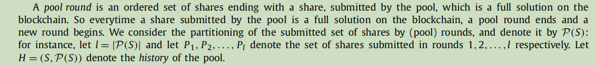
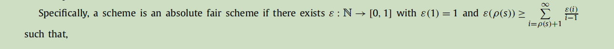
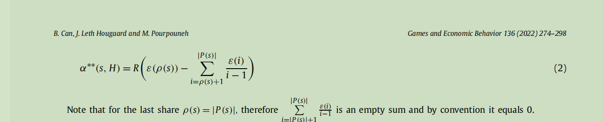
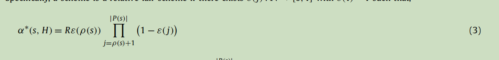
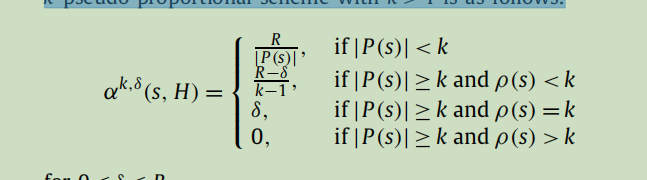
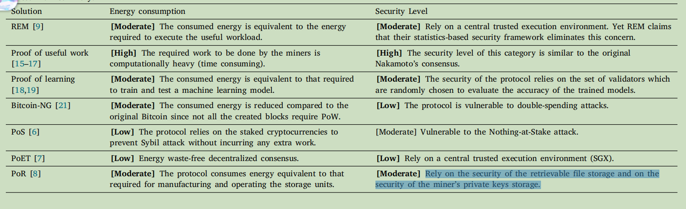

# 1 Reward Sharing Schemes for Stake Pools(full version)

POS+zk_rollup

## 核心内容：$r(\sigma,\lambda)$ ~ $\sigma^{'}+\alpha^{'}\lambda$

其中，$\sigma^{'}=min(\sigma,\beta)$,$\alpha^{'}=\alpha\frac{\sigma^{'}-\lambda(1-\frac{\sigma^{'}}{\beta})}{\beta}$.

其中 $\sigma$是该池的总stake，$\lambda$是该池主人的stake $\beta=\frac{1}{k}$是理想池子数的倒数

$r(\sigma,\lambda)$是池子的分配函数

池子内部，在扣除$c_i$的成本后，池子主人先领取$mi$比例的盈余，剩下的按比例均分

## 主要结论

### 结论1： 池子平均分配会收敛到仅仅一个池子

### 结论2：完美策略都是纳什均衡

$D,P$被用来表示吸引力和总盈利能力

# 2 On reward sharing in blockchain mining pools

## 核心内容

### 设定
POW，大家一直提交证明，直到生成一个完整证明？怎么生成？

收益：矿池固定总收益B，然后主人拿走一定比例后，按证明数量分成
要求：当某一轮增长时，现有收益减少相同的值/相同比例
我们挑出一类特定的方案，称为绝对公平方案。我们证明了这是唯一一个满足绝对再分配、固定的总奖励、预算限制、基于回合的奖励和延迟不变性的类

在本节中，我们挑出一类特定的方案，称为一类相对公平方案。我们证明了这是唯一一个满足相对再分配、固定的总奖励、预算限制、基于轮的奖励和延迟不变性的类

k-伪比例方案

# 3 Green-PoW An energy-efficient blockchain Proof-of-Work consensus algorithm

## Problem
用多余的算力来进行机器学习任务
一些总结

## Solution
亚军参加附加轮
节省能源，对合作不能抑制？最起码可以合作抢亚军，容易造成拆分。这个或许与收益方式不矛盾。
同时可能会改变合作倾向？

# 4 HEB
提供了不同于POW的结果

# 5 Improving Transaction Speed and Scalability of Blockchain Systems via Parallel Proof of Work 
并行算法，感觉不如3

# Problem to solve

## 2024/2/28
Problem 1 POS他貌似只是给了一个Nash均衡，结论直接用？

Problem 2 要仿照他们进行合作/攻击分析？是否做实验

## 2024/3/6
Problem 1：paper 2可能可以用在多zk方面。

